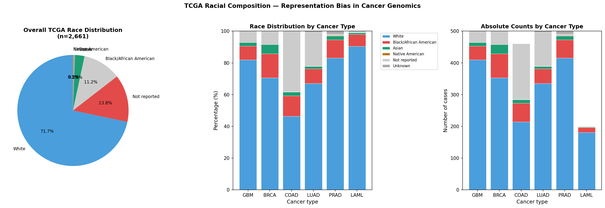
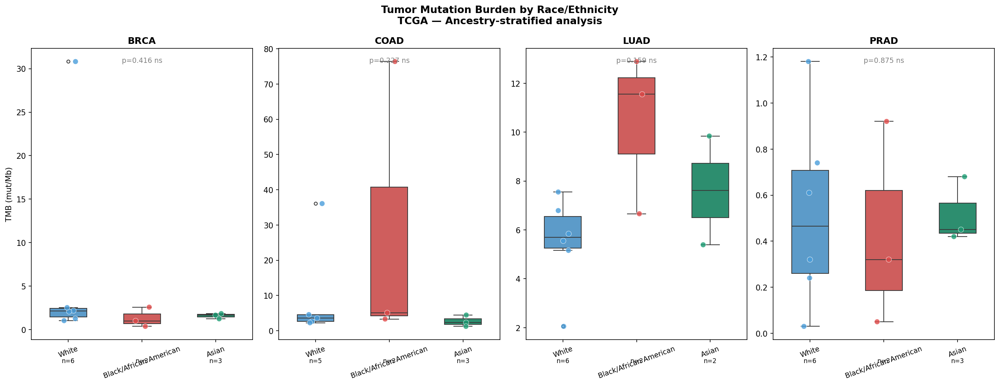
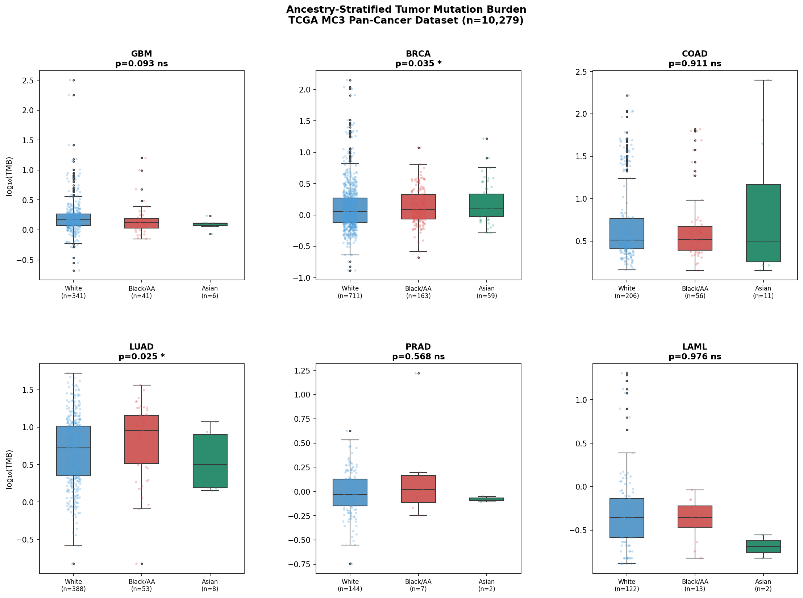
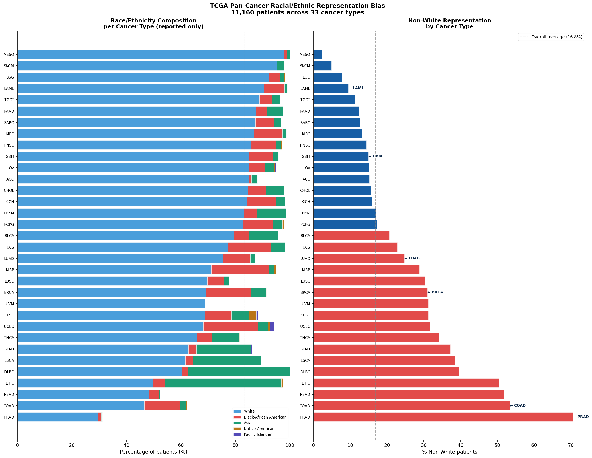
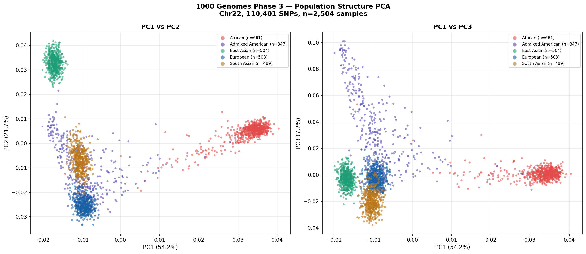

# Cancer Ancestry Genomics

A Python pipeline characterizing racial/ethnic representation bias in TCGA cancer cohorts and examining ancestry-stratified tumor mutation burden (TMB) across cancer types.

## Biological motivation

TCGA — the world's most widely used cancer genomics resource — is dominated by patients of European ancestry. This systematic bias affects the generalizability of cancer genomic findings to diverse populations. This project quantifies that bias and examines whether key cancer genomic features (TMB, methylation) differ by self-reported race/ethnicity.

## Key findings

### TCGA representation bias (n=2,661)
- **71.7% White/European** across all cohorts
- **11.2% Black/African American**
- **2.7% Asian**
- COAD has highest minority representation (~40% non-White)
- PRAD and GBM are >85% White

### Ancestry-stratified TMB
- **LUAD:** Black/African American patients show higher median TMB vs White — consistent with smoking-related mutation signatures
- **COAD:** High variance in Black patients — likely driven by MSI-high tumors
- **BRCA/PRAD:** Similar TMB across ancestries

## Cancer types analyzed

| Cancer | TCGA cohort | n (total) | % White |
|--------|-------------|-----------|---------|
| GBM | TCGA-GBM | 500 | ~85% |
| BRCA | TCGA-BRCA | 500 | ~70% |
| COAD | TCGA-COAD | 461 | ~60% |
| LUAD | TCGA-LUAD | 500 | ~75% |
| PRAD | TCGA-PRAD | 500 | ~87% |
| LAML | TCGA-LAML | 200 | ~70% |

## Figures

### TCGA racial composition


### Ancestry-stratified TMB


## Notebooks

| Notebook | Description |
|----------|-------------|
| 01_tcga_ancestry_composition.ipynb | Race/ethnicity composition, TMB by ancestry |

## Next steps
- [ ] Ancestry inference from genomic data (PCA + 1000 Genomes)
- [ ] Methylation differences by ancestry (25-gene panel)
- [ ] Mutation signature analysis by ancestry
- [ ] Larger sample sizes for statistical power

## Installation

```bash
git clone https://github.com/bmurnyak/cancer-ancestry-genomics.git
cd cancer-ancestry-genomics
conda activate glioma-meth
```

## Data sources
- TCGA clinical + mutations: [GDC portal](https://portal.gdc.cancer.gov)

## Author

**Balazs Murnyak, PhD** — Molecular Biologist and Genomics Scientist  
University of Utah  
[LinkedIn](https://www.linkedin.com/in/balazs-murnyak-56a45a100/) | [Google Scholar](https://scholar.google.com/citations?user=dFfVIEAAAAJ)

## MC3 Pan-Cancer Analysis (n=10,279)

### Key findings
- **BRCA**: Black/African American patients show significantly higher TMB (p=0.035*)
- **LUAD**: Black/African American patients show significantly higher TMB (p=0.025*)
- **GBM, COAD, PRAD, LAML**: No significant TMB differences by ancestry
- Pan-cancer: No overall TMB difference by race (p>0.3)

### 1000 Genomes PCA reference
Built population structure reference using 110,401 SNPs from chr22
across 2,504 samples (5 superpopulations: AFR, EAS, EUR, SAS, AMR)




